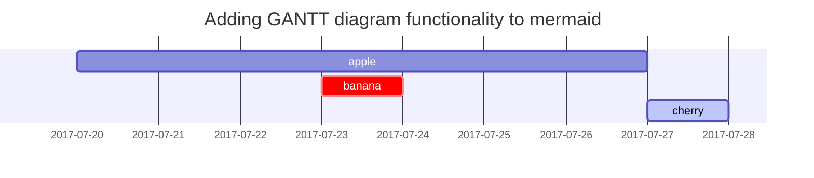

本文是 Chirpy 主题的完整使用指南，整合了站点创建、文章撰写、排版元素、媒体嵌入与部署上线的全部内容，可作为日常写博客的参考手册。

## 创建站点仓库

创建站点仓库有两种方式：

### 方式一：使用 Starter（推荐）

这种方式简化了升级流程、隔离了不必要的文件，适合希望专注于写作、配置最小化的用户。

1. 登录 GitHub，进入 [**starter**][starter]。
2. 点击 <kbd>Use this template</kbd>，选择 <kbd>Create a new repository</kbd>。
3. 将新仓库命名为 `<username>.github.io`，其中 `username` 替换为你的小写 GitHub 用户名。

### 方式二：Fork 主题

这种方式便于修改功能或 UI 设计，但升级时会有冲突。除非你熟悉 Jekyll 并计划深度修改主题，否则不建议。

1. 登录 GitHub。
2. [Fork 主题仓库](https://github.com/cotes2020/jekyll-theme-chirpy/fork)。
3. 将新仓库命名为 `<username>.github.io`。

## 设置开发环境

### 使用 Dev Containers（推荐 Windows）

Dev Containers 通过 Docker 提供隔离环境，避免与系统冲突。

1. 安装 Docker：Windows/macOS 安装 [Docker Desktop][docker-desktop]，Linux 安装 [Docker Engine][docker-engine]。
2. 安装 [VS Code][vscode] 和 [Dev Containers 扩展][dev-containers]。
3. 克隆仓库：Docker Desktop 用户在 VS Code 中[在容器卷中克隆仓库][dc-clone-in-vol]；Docker Engine 用户先本地克隆，再[在容器中打开][dc-open-in-container]。
4. 等待 Dev Containers 初始化完成。

### 原生安装（推荐 Unix-like 系统）

1. 按照 [Jekyll 安装指南](https://jekyllrb.com/docs/installation/) 安装 Jekyll，确保已安装 [Git](https://git-scm.com/)。
2. 克隆仓库到本地。
3. 如果 Fork 了主题，安装 [Node.js][nodejs] 并在根目录运行 `bash tools/init.sh` 初始化仓库。
4. 在仓库根目录运行 `bundle` 安装依赖。

## 撰写新文章

### 命名与路径

创建一个名为 `YYYY-MM-DD-TITLE.EXTENSION`{: .filepath} 的新文件，放在根目录的 `_posts`{: .filepath} 文件夹中。`EXTENSION`{: .filepath} 必须是 `md`{: .filepath} 或 `markdown`{: .filepath}。也可以使用 [`Jekyll-Compose`](https://github.com/jekyll/jekyll-compose) 插件来加速创建文件。

### Front Matter

在文章顶部填写 [Front Matter](https://jekyllrb.com/docs/front-matter/)：

```yaml
---
title: TITLE
date: YYYY-MM-DD HH:MM:SS +/-TTTT
categories: [TOP_CATEGORIE, SUB_CATEGORIE]
tags: [TAG]     # TAG names should always be lowercase
---
```

> 文章的 _layout_ 默认已设为 `post`，无需在 Front Matter 中添加 _layout_ 变量。
{: .prompt-tip }

### 时区

为了准确记录发布日期，不仅要在 `_config.yml`{: .filepath} 中设置 `timezone`，还要在 Front Matter 的 `date` 变量中提供时区。格式：`+/-TTTT`，例如 `+0800`。

### 分类与标签

每篇文章的 `categories` 最多包含两个元素，`tags` 的数量可以从零到无穷。例如：

```yaml
---
categories: [Animal, Insect]
tags: [bee]
---
```

### 作者信息

文章的作者信息通常不需要在 Front Matter 中填写，默认会从配置文件的 `social.name` 和 `social.links` 的第一个条目获取。也可以通过以下方式覆盖：

在 `_data/authors.yml` 中添加作者信息（如果文件不存在则创建）：

```yaml
<author_id>:
  name: <full name>
  twitter: <twitter_of_author>
  url: <homepage_of_author>
```
{: file="_data/authors.yml" }

然后使用 `author` 指定单个条目或 `authors` 指定多个条目：

```yaml
---
author: <author_id>                     # for single entry
# or
authors: [<author1_id>, <author2_id>]   # for multiple entries
---
```

> 从 `_data/authors.yml`{: .filepath } 读取作者信息的好处是页面会拥有 `twitter:creator` 元标签，有助于 [Twitter Cards](https://developer.twitter.com/en/docs/twitter-for-websites/cards/guides/getting-started#card-and-content-attribution) 和 SEO。
{: .prompt-info }

### 文章描述

默认情况下，文章开头的文字会用于首页文章列表、_Further Reading_ 部分和 RSS feed。可以通过 Front Matter 的 `description` 字段自定义：

```yaml
---
description: Short summary of the post.
---
```

`description` 文本也会显示在文章页面的标题下方。

### 目录

默认情况下，目录（TOC）显示在文章右侧面板。如果想全局关闭，在 `_config.yml`{: .filepath} 中将 `toc` 设为 `false`。如果想对特定文章关闭：

```yaml
---
toc: false
---
```

### 评论

评论的全局设置由 `_config.yml`{: .filepath} 中的 `comments.provider` 选项定义。选择评论系统后，所有文章都会启用评论。

如果想关闭特定文章的评论：

```yaml
---
comments: false
---
```

### 置顶文章

可以将一篇或多篇文章置顶到首页顶部，置顶文章按发布日期逆序排列：

```yaml
---
pin: true
---
```

## 排版与内容元素

### 标题层级

```markdown
# H1 — heading
## H2 — heading
### H3 — heading
#### H4 — heading
```

### 列表

有序列表：

```markdown
1. Firstly
2. Secondly
3. Thirdly
```

无序列表：

```markdown
- Chapter
  - Section
    - Paragraph
```

待办列表：

```markdown
- [ ] Job
  - [x] Step 1
  - [x] Step 2
  - [ ] Step 3
```

描述列表：

```markdown
Sun
: the star around which the earth orbits

Moon
: the natural satellite of the earth, visible by reflected light from the sun
```

### 引用块

```markdown
> This line shows the _block quote_.
```

### 提示框

有四种类型的提示框：`tip`、`info`、`warning` 和 `danger`。通过给引用块添加 `prompt-{type}` 类来生成：

```markdown
> An example showing the `tip` type prompt.
{: .prompt-tip }

> An example showing the `info` type prompt.
{: .prompt-info }

> An example showing the `warning` type prompt.
{: .prompt-warning }

> An example showing the `danger` type prompt.
{: .prompt-danger }
```

### 表格

```markdown
| Company                      | Contact          | Country |
| :--------------------------- | :--------------- | ------: |
| Alfreds Futterkiste          | Maria Anders     | Germany |
| Island Trading               | Helen Bennett    |      UK |
| Magazzini Alimentari Riuniti | Giovanni Rovelli |   Italy |
```

### 链接与脚注

自动链接：直接写 URL 即可生成链接，如 <http://127.0.0.1:4000>。

脚注：

```markdown
Click the hook will locate the footnote[^footnote], and here is another footnote[^fn-nth-2].

[^footnote]: The footnote source
[^fn-nth-2]: The 2nd footnote source
```

### 行内代码与文件路径

行内代码：

```markdown
This is an example of `Inline Code`.
```

文件路径高亮：

```markdown
Here is the `/path/to/the/file.extend`{: .filepath}.
```

## 代码块

### 基本用法

使用三个反引号创建代码块：

```text
This is a common code snippet, without syntax highlight and line number.
```

### 指定语言

在反引号后指定语言以获得语法高亮：

````markdown
```bash
if [ $? -ne 0 ]; then
  echo "The command was not successful.";
  #do the needful / exit
fi;
```
````

> Jekyll 的 `` 标签与本主题不兼容。
{: .prompt-danger }

### 行号

默认情况下，除 `plaintext`、`console` 和 `terminal` 外的所有语言都会显示行号。要隐藏行号，添加 `nolineno` 类：

````markdown
```shell
echo 'No more line numbers!'
```
{: .nolineno }
````

### 指定文件名

添加 `file` 属性可将代码块顶部的语言名替换为文件名：

````markdown
```sass
@import
  "colors/light-typography",
  "colors/dark-typography";
```
{: file='_sass/jekyll-theme-chirpy.scss'}
````

### Liquid 代码

要展示 **Liquid** 代码片段，用 `` 和 `` 包裹，或者在 Front Matter 中添加 `render_with_liquid: false`（需要 Jekyll 4.0+）。

## 数学公式

使用 [**MathJax**][mathjax] 生成数学公式。出于性能考虑，数学功能默认不加载，需要启用：

```yaml
---
math: true
---
```

语法规则：

- **块级公式**：用 `$$ math $$` 包裹，前后**必须**有空行
  - **公式编号**：用 `$$\begin{equation} math \end{equation}$$`
  - **引用编号**：在公式块中使用 `\label{eq:label_name}`，在文中用 `\eqref{eq:label_name}` 引用
- **行内公式**（在行中）：用 `$$ math $$` 包裹，前后无空行
- **行内公式**（在列表中）：用 `\$$ math $$`

示例：

```
$$
\begin{equation}
  \sum_{n=1}^\infty 1/n^2 = \frac{\pi^2}{6}
  \label{eq:series}
\end{equation}
$$
```

可以引用为 \eqref{eq:series}。

当 $a \ne 0$ 时，$ax^2 + bx + c = 0$ 有两个解：

$$ x = {-b \pm \sqrt{b^2-4ac} \over 2a} $$

> 从 `v7.0.0` 开始，**MathJax** 的配置选项已移至 `assets/js/data/mathjax.js`{: .filepath } 文件，可以根据需要修改选项，如添加[扩展][mathjax-exts]。
{: .prompt-tip }

## Mermaid 图表

[**Mermaid**](https://github.com/mermaid-js/mermaid) 是优秀的图表生成工具。在文章中启用：

```yaml
---
mermaid: true
---
```

然后用 ```` ```mermaid ```` 和 ```` ``` ```` 包裹图表代码：



## 媒体资源

图片、音频和视频在 Chirpy 中统称为媒体资源。

### URL 前缀

可以为多个资源定义重复的 URL 前缀，避免繁琐操作：

- 如果使用 CDN 托管媒体文件，在 `_config.yml`{: .filepath } 中指定 `cdn`。媒体资源的 URL 会自动加上 CDN 域名前缀。

  ```yaml
  cdn: https://cdn.com
  ```
  {: file='_config.yml' .nolineno }

- 要为当前文章指定资源路径前缀，在 Front Matter 中设置 `media_subpath`：

  ```yaml
  ---
  media_subpath: /path/to/media/
  ---
  ```
  {: .nolineno }

`site.cdn` 和 `page.media_subpath` 可以单独或组合使用，最终资源 URL 为：`[site.cdn/][page.media_subpath/]file.ext`

### 图片

#### 标题

在图片下一行添加斜体文字，即可成为图片标题：

```markdown

_Image Caption_
```
{: .nolineno}

#### 尺寸

为防止图片加载时页面布局偏移，应设置宽度和高度：

```markdown
{: width="700" height="400" }
```
{: .nolineno}

> 对于 SVG，至少需要指定 _width_，否则不会渲染。
{: .prompt-info }

从 _Chirpy v5.0.0_ 起，`height` 和 `width` 支持缩写（`h`、`w`）。

#### 位置

默认居中，可通过 `normal`、`left`、`right` 类指定位置：

```markdown
{: .normal }
{: .left }
{: .right }
```

> 指定位置后不应再添加图片标题。
{: .prompt-warning }

#### 暗色/亮色模式

准备两张图片，分别添加 `dark` 或 `light` 类：

```markdown
{: .light }
{: .dark }
```

#### 阴影

程序窗口截图可以添加阴影效果：

```markdown
{: .shadow }
```
{: .nolineno}

#### 预览图

在文章顶部添加图片，分辨率为 `1200 x 630`。图片宽高比需为 `1.91 : 1`，否则会缩放裁剪。

```yaml
---
image:
  path: /path/to/image
  alt: image alternative text
---
```

也可以简化为：

```yml
---
image: /path/to/image
---
```

#### LQIP

预览图低质量图像占位符：

```yaml
---
image:
  lqip: /path/to/lqip-file # or base64 URI
---
```

普通图片：

```markdown
{: lqip="/path/to/lqip-file" }
```
{: .nolineno }

### 视频

#### 社交媒体平台

使用以下语法嵌入社交媒体视频：

```liquid

```

`Platform` 为平台名小写，`ID` 为视频 ID。支持的平台：

| Video URL                                                                                          | Platform   | ID             |
| -------------------------------------------------------------------------------------------------- | ---------- | :------------- |
| [https://www.**youtube**.com/watch?v=**H-B46URT4mg**](https://www.youtube.com/watch?v=H-B46URT4mg) | `youtube`  | `H-B46URT4mg`  |
| [https://www.**twitch**.tv/videos/**1634779211**](https://www.twitch.tv/videos/1634779211)         | `twitch`   | `1634779211`   |
| [https://www.**bilibili**.com/video/**BV1Q44y1B7Wf**](https://www.bilibili.com/video/BV1Q44y1B7Wf) | `bilibili` | `BV1Q44y1B7Wf` |

#### 视频文件

直接嵌入视频文件：

```liquid

```

支持的属性：

- `poster='/path/to/poster.png'` — 视频下载时显示的海报图
- `title='Text'` — 视频标题
- `autoplay=true` — 自动播放
- `loop=true` — 循环播放
- `muted=true` — 静音
- `types` — 指定额外视频格式的扩展名，用 `|` 分隔

完整示例：

```liquid

```

### 音频

嵌入音频文件：

```liquid

```

支持的属性：

- `title='Text'` — 音频标题
- `types` — 指定额外语频格式的扩展名，用 `|` 分隔

完整示例：

```liquid

```

## 自定义 Favicon

Chirpy 的 [favicons](https://www.favicon-generator.org/about/) 放在 `assets/img/favicons/`{: .filepath} 目录中。可以用自己的图标替换默认图标。

### 生成 Favicon

准备一张 512x512 或更大的方形图片（PNG、JPG 或 SVG），访问 [**Real Favicon Generator**](https://realfavicongenerator.net/)，点击 <kbd>Select your Favicon image</kbd> 上传图片。

在下一步中保持默认选项，滚动到页面底部，点击 <kbd>Generate your Favicons and HTML code</kbd> 生成 favicon。

### 下载与替换

下载生成的压缩包，解压后删除以下两个文件：

- `browserconfig.xml`{: .filepath}
- `site.webmanifest`{: .filepath}

将剩余的图片文件（`.PNG`{: .filepath} 和 `.ICO`{: .filepath}）复制到 Jekyll 站点的 `assets/img/favicons/`{: .filepath} 目录，覆盖原文件。如果该目录不存在则创建。

| File(s) | From Online Tool | From Chirpy |
| ------- | :--------------: | :---------: |
| `*.PNG` |        ✓         |      ✗      |
| `*.ICO` |        ✓         |      ✗      |

> ✓ 表示保留，✗ 表示删除。
{: .prompt-info }

下次构建站点时，favicon 将替换为自定义版本。

## 配置与自定义

### 基本配置

根据需要更新 `_config.yml`{: .filepath} 中的变量，常用选项包括：

- `url`
- `avatar`
- `timezone`
- `lang`

### 社交联系方式

社交联系方式显示在侧边栏底部。可以在 `_data/contact.yml`{: .filepath} 文件中启用或禁用特定联系方式。

### 自定义样式

要自定义样式，将主题的 `assets/css/jekyll-theme-chirpy.scss`{: .filepath} 文件复制到 Jekyll 站点的相同路径，在文件末尾添加自定义样式。

### 静态资源

从 `5.1.0` 版本起引入了静态资源配置。静态资源的 CDN 在 `_data/origin/cors.yml`{: .filepath } 中定义，可以根据网站发布区域的网络条件替换。如果希望自托管静态资源，参考 [_chirpy-static-assets_](https://github.com/cotes2020/chirpy-static-assets#readme) 仓库。

### 启动本地服务器

运行本地服务器：

```terminal
$ bundle exec jekyll s
```

> 如果使用 Dev Containers，必须在 **VS Code** 终端中运行该命令。
{: .prompt-info }

几秒后，本地服务器将在 <https://127.0.0.1:4000> 可用。

## 部署

部署前检查 `_config.yml`{: .filepath}，确保 `url` 配置正确。如果使用 [**项目站点**](https://help.github.com/en/github/working-with-github-pages/about-github-pages#types-of-github-pages-sites) 且不使用自定义域名，或想在非 GitHub Pages 的 Web 服务器上使用 base URL 访问，记得将 `baseurl` 设为项目名（以斜杠开头），如 `/project-name`。

### 使用 GitHub Actions 部署

准备工作：

- 如果使用 GitHub Free 计划，保持仓库公开。
- 如果已提交 `Gemfile.lock`{: .filepath} 且本地不是 Linux，更新锁定文件的平台列表：

  ```console
  $ bundle lock --add-platform x86_64-linux
  ```

配置 Pages 服务：

1. 进入 GitHub 仓库，选择 _Settings_ → _Pages_，在 **Source** 中选择 [**GitHub Actions**][pages-workflow-src]。

2. 推送任意 commit 到 GitHub 以触发 Actions 工作流。在仓库的 _Actions_ 标签页可以看到 _Build and Deploy_ 工作流。构建成功后站点将自动部署。

### 手动构建与部署

对于自托管服务器，需要在本地构建站点后上传文件：

```console
$ JEKYLL_ENV=production bundle exec jekyll b
```

除非指定了输出路径，生成的站点文件将放在项目根目录的 `_site`{: .filepath} 文件夹中。将这些文件上传到目标服务器。

## 了解更多

更多关于 Jekyll 文章的知识，请访问 [Jekyll Docs: Posts](https://jekyllrb.com/docs/posts/)。

[nodejs]: https://nodejs.org/
[starter]: https://github.com/cotes2020/chirpy-starter
[pages-workflow-src]: https://docs.github.com/en/pages/getting-started-with-github-pages/configuring-a-publishing-source-for-your-github-pages-site#publishing-with-a-custom-github-actions-workflow
[docker-desktop]: https://www.docker.com/products/docker-desktop/
[docker-engine]: https://docs.docker.com/engine/install/
[vscode]: https://code.visualstudio.com/
[dev-containers]: https://marketplace.visualstudio.com/items?itemName=ms-vscode-remote.remote-containers
[dc-clone-in-vol]: https://code.visualstudio.com/docs/devcontainers/containers#_quick-start-open-a-git-repository-or-github-pr-in-an-isolated-container-volume
[dc-open-in-container]: https://code.visualstudio.com/docs/devcontainers/containers#_quick-start-open-an-existing-folder-in-a-container
[mathjax]: https://www.mathjax.org/
[mathjax-exts]: https://docs.mathjax.org/en/latest/input/tex/extensions/index.html
